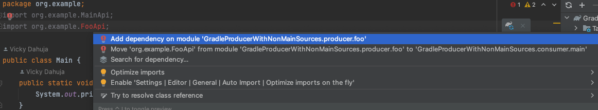

The goal of this project is to verify if a consumer depend on producer module where
* producer has main source dir
* producer has generated non-main source dir

Producer has
- src -> main -> MainApi
- src -> foo  -> FooApi

Consumer depends on Producer and tries to use
```
import org.example.MainApi; // <-- Resolved
import org.example.FooApi;  // <-- NOT resolved
```

### Resolved 
Resolved after adding the following to the producer's build.gradle
```
sourceSets {
    main {
        java {
            srcDir "src/foo/java"
        }
    }
}
```

Also, the shortcut to add dependency does not work
